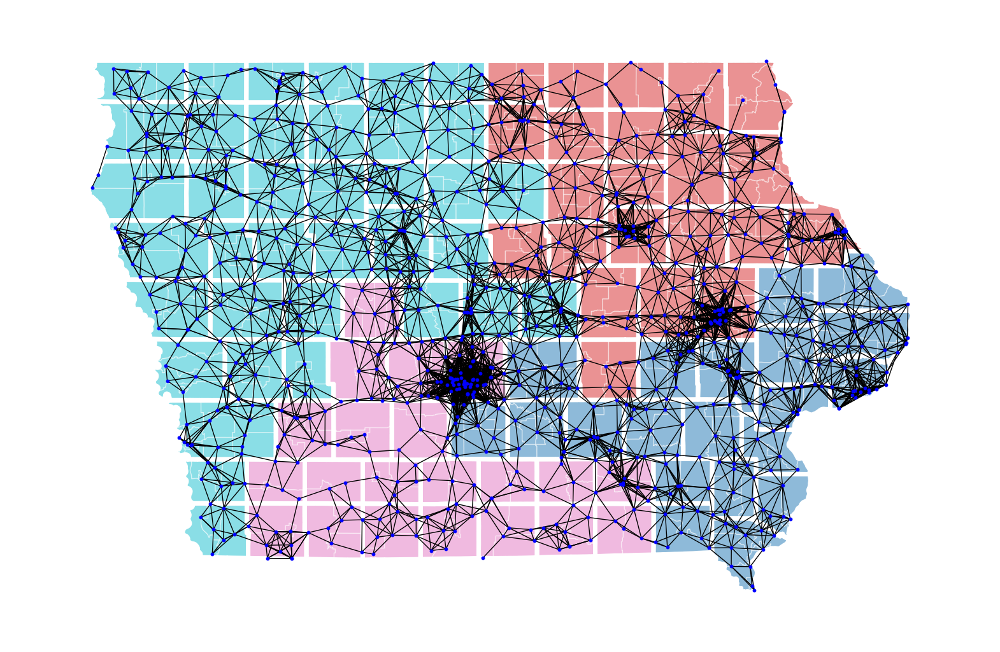

# The Traveling Mailman: Topological Optimization Methods for User-Centric Redistricting

This repository contains the code, images, and data used in the manuscript "The Traveling Mailman: Topological Optimization Methods for User-Centric Redistricting" submitted to the Journal of Applied and Computational Topology.

## Overview

This project presents a novel approach to evaluating and generating electoral districting plans by integrating Topological Data Analysis (TDA) with Markov Chain Monte Carlo (MCMC) simulations. By leveraging the postal network as a proxy for community cohesion and employing persistent homology, our method provides a sophisticated evaluation of community structures, surpassing traditional centroid-based measures.

